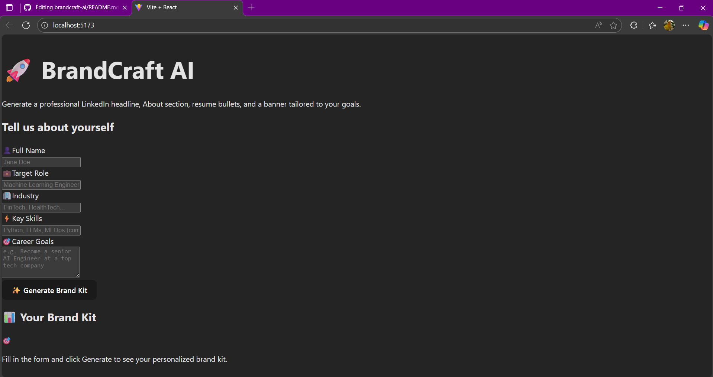

# brandcraft-ai
# BrandCraftAI 🚀

[](https://reactjs.org/) 
[](https://fastapi.tiangolo.com/) 
[](https://openai.com/)

BrandCraftAI is an AI-powered platform that helps users generate and manage creative brand content efficiently. With intelligent AI suggestions and an intuitive interface, BrandCraftAI streamlines brand content creation and management for individuals and businesses.

---

## ✨ Features

- **Frontend:** Modern **React + Vite** interface for fast, responsive UI.  
- **Backend:** **FastAPI REST API** powering AI-driven operations.  
- **AI Integration:** Leverages **OpenAI** for intelligent content suggestions.  
- **User-Friendly UX:** Simple dashboard for managing brand content quickly.  
- **Extensible:** Easy to add new features and AI capabilities.

---

## 💻 Live Demo / Screenshots

  
*(Replace `demo.gif` with an actual GIF or screenshots of your app)*

- **Home Page:**   

---

## 🚀 Getting Started


## 🚀 Getting Started

### Frontend

```bash
cd frontend
npm install
npm run dev

npm install
npm run dev
